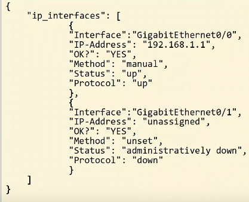
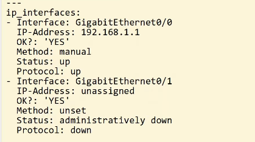

# Day 60 - JSON, XML & YAML

## Data Serialization

- Data Serialization is the process of converting data into a standardized format/structure that can be stored (in a file) or transmitted (over a network) and reconstructed later (ie. by a different application).
    - This allows the data to be communicated between applications in a way both applications can understand.

- Data serialization languages allow us to **represent variables with text**:
    ```json
    {
        "interface_name": "GigabitEthernet1/1",
        "status": "up",
        "ip_address": "192.168.1.1",
        "netmask": "255.255.255.0"
    }
    ```
    - **Variables** are **containers that store values**.
        - "interface_name" = container
        - "GigabitEthernet1/1" = value


## JSON (JavaScript Object Notation)

- **JSON (JavaScript Object Notation)** is an **open standard file format** and **data interchange format** that uses human-readable text to store and transmit data objects,
- It is standardized in RFC 8259.
- It was derived from Javascript, but it's language independent and many modern programming languages are able to generate and read JSON data.
    - REST APIs often use JSON.

- **Whitespace** is **insignificant**.
- JSON can represent **four 'primitive' data types**:
    - **string**
    - **number**
    - **boolean**
    - **null**
- JSON also as **two 'structured' data types**:
    - **object**
        - unordered list of key-value pairs (variables).
        - Objects are surrounded by curly brackets `{}`.
        - They key is a string.
        - The value is any valid JSON data type (string, number, boolean, null, object, array).
        - The key and value are separated by a colon.
        - If there are multiple key-value pairs, each pair is separated by a comma.
    - **array** 
        - not key-value pair
        - the values don't have to be the same data type

    

## XML (Extensible Markup Language)

- XML (Extensible Markup Language) was **developed as a markup language**, but is **now used as a general data serialization language**.
    - markup languages (ie. HTML) are used to format text (font, size, color, headings, etc.)
- XML is generally **less human-readble than JSON**.
- Whitespace is insignificant.
- Often used by REST APIs.
- `<key>value</key>`
- In Cisco IOS you can do, for example, `show ip interface brief | format` to display the output in XML
    

## YAML

- **YAML** originally means *Yet Another Markup Language*, but to distinguis its purpose as a data-serialization language rather than a markup language it was repurposed to *YAML Aint Markup Language*.
- YAML is **used by** the network automation tool **Ansible**.
- YAML is very human-readable.
- Whitespace is significant (unlike JSON and XML)
    - Indentation is very important.
- YAML files start with `---`.
- `-` is used to indicate a list.
- Keys and values are represented as `key:value`.


    