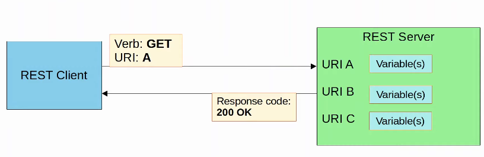

# Day 61 - REST APIs

## APIs

-   An API (Application Programming Interface) is a software interface that allows two applications to communicate with each other.
-   APIs are essential not just for network automation, but for all kinds of applications.
-   In SDN architecture, APIs are used to communicate between apps and the SDN controller (via the NBI), and between the SDN controller and the network devices (via the SBI).
-   The NBI typically uses REST APIs.
-   NETCONF and RESTCONF are popular southbound APIs.

## CRUD

-   **CRUD (Create, Read, Update, Delete)** refers to the operations we perform using REST APIs.

-   **Create** operations are used to create new variables and set their initial variables.
-   **Read** operations are used to retrieve the value of a variable.
-   **Update** operations are used to the value of a variable.
-   **Delete** operations are used to delete variables.

-   HTTP uses verbs (aka methods) that map to these CRUD operations.
-   REST APIs typically use HTTP.

## HTTP Verbs

| Purpose | CRUD Operation | HTTP Verb |
| ------- | -------------- | --------- |
| Create new variable | Create | POST |
| Retrieve value of variable | Read | GET |
| Change the value of variable | Update | PUT, PATCH |
| Delete variable | Delete | DELETE |

## HTTP Request 

- When an HTTP client sends a request to an HTTP server, the HTTP header includes information like this:
    - An HTTP verb (e.g. GET)
    - An URI (Uniform Resource Identifier), indicating the resource it is trying to access.

- URI example: `http://sandboxdnac.cisco.com/dna/intent/api/v1/network-device`
    - `http`: scheme
    - `sandboxdnac.cisco.com`: authority
    - `/dna/intent/api/v1/network-device`: path

- The HTTP request can include additional header which pass additional information to the server:

- An example would be an `Accept` header, which informa the server about the type(s) of data that can be sent back to the client:
    - `Accept: application/json` or `Accept: application/xml`

- When a REST client makes an API call (request) to a REST server, it will send an HTTP request like the one above.
    - note: APIs don't have to use HTTP for communication, although HTTP is the most common choice.

## HTTP Response

- The server's response will include a status code indicating if the request succeeded or failed, as well as other details.

- The **first digit** indicates the **class of the response**:
    - **`1xx` informational:** the request was received, continuing process.
        - e.g. **102 Processing** - indicates that the server has received the request and is processing it, but the response is not yet available.
    - **`2xx` successful:** the request was successfully received, understood, and accepted. 
        - e.g. **200 OK** indicates that the request succeeded.
        - e.g. **201 Created** indicates that the request succeeded and a new resource was created (ie. in the response POST).
    - **`3xx` redirection:** further action needs to be taken in order to complete the request.
        - e.g. **301 Moved Permanently** indicates that the request resource has been moved, and the server indicates its new location.

    - **`4xx` client error:** the request contains bad syntax or cannot be fulfilled
        - e.g. **403 Unauthorized** means the client must authenticate to get a response.
        - e.g. **403 Not Found** means the requested resource was not found.

    - **`5xx` server error:**
        - e.g. **503 Internal Server Error** means the server encountered something unexpected that it doesn't know how to handle.

## REST (Representational State Transfer)

- **REST APIs** are also known as **REST-based APIs** or **RESTful APIs**.
    - REST isn't a specific API. Instead, it describes a set of rules about how the API should work.

- The **six constrainsts of RESTful architectures** are:
    - **Uniform Interface**
    - **Client-server**
    - **Stateless**
    - **Cacheable or non-cacheable**
    - **Layered system**
    - **Code-on-demand** (optional)

- For applications to communicate over a network, networking protocols must be used to facilitate communications (for REST APIs, HTTP(s) is the most common choice)

#### REST: Client-Server

- REST APIs use a client-server architecture.
- The **client uses API calls** (HTTP requests) **to access the resources on the server**.
- The **separation between the client and server** means **they can both change and evolve independently** of each other.
    - When the client application changes or the server application changes, the interface between them must not break.

    

#### REST: Stateless

- REST APIs exchanges are stateless.
- This means that **each API exchange** is a **separate event**, independent of all past exchanges between the client and the server.
    - The **server does not store information about previous requests** from the client to determine how it should respond to events.
- If authentication is required, this means that the client must authenticate with the server for each request it makes.
- **TCP** is an example of a **stateful protocol**. 
- **UDP** is an example of a **stateless protocol**.

- **NOTE:** Although REST APIs use HTTP, which uses TCP (stateful) as its L4 Protocol, HTTP and REST APIs themselves aren't stateful. The functions of each layer are separate.

#### REST: Cacheable or Non-Cacheable

- REST APIs must support caching of data.

- Caching refers to storing data for future use. (this improves performance for the client and reduces the load on the server).

- Not all resources have to be cacheable, but cacheable resources must be declared as cacheable.

## Cisco DevNet

- Cisco DevNet is Cisco's developer program to help developers and IT professionals who want to write applications and develop integrations with Cisco products, platforms and APIs.

- DevNet offers lots of free resources such as courses, tutorials, labs, sandboxes, documentation, etc. to learn about automation and develop your skills.

- There is also a DevNet certification track that you can pursue if you're interested in automation.
