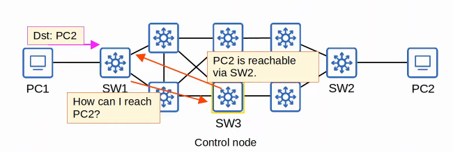

# Day 62 - Software-Defined Networking

## SDN Review

- **Software-Defined Networking (SDN)** is an approach to networking that centralizes the control plane into an application called a controller.
- Traditional control planes use a distributed architecture.
- An SDN controller centralizes control plane functions like calculating routes.
- The controller can interact programmatcally with the network devices using APIs.
- The **SBI** is **used for communications between the controller and the network devices it controls**.
- The **NBI** is **what allows us to interact with the controller with our scripts and applications**.

## SDN Architecture

- **Application Layer:**
    - Contains scripts/applications that tell the SDN controller what network behaviours are desired.
- **Control Layer:**
    - Contains the SDN controller that receives processes intructions from the application layer.

- **Infrastructure Layer:**
    - Contains the network devices that are responsible for forwarding messages across the network.

## Cisco SD-Access

- Cisco SD-Access is Cisco's SDN solution for automating campus LANs.
    - **ACI (Application Campus Infrastructure)** is their **SDN solution for automating data center networks**.
    - **SD-WAN** is their **SDN solution for automating WANs**.

- Cisco **DNA (Digital Network Architecture)** is the **controller at the center of SD-Access**
    

- The **underlay** is the underlying physical network of devices and connections (including wired and wireless) which provide IP connectivity (e.g. using IS-IS).
    - Multilayer switches and their connections.

- The **overlay** is the virtual network built on top of the physical underlay network.
    - SD-Access uses VXLAN (Virtual Extensible LAN) to build tunnels.

- The **fabric** is the combination of the overlay and underlay; the physical and virtual network as a whole.

### SD-Access Underlay

- The underlay's purpose is to **support the VXLAN tunnels of the overlay**.
- There are **three different roles for switches** in SD-Access:
    - **Edge nodes:** Connect to end hosts
    - **Border nodes:** Connect to devices outside of the SD-Access domain, ie. WAN routers. 
    - **Control nodes:** Use LISP (Locator ID Separation Protocol) to perform various control plane functions.

- You can **add SD-Access on top of an existing network (brownield deployment)** if your network hardware and software supports it.
    - In this case DNA center won't configure the underlay.

- A **new deployment (greenfield deployment)** will be configured by DNA Center to use the optimal SD-Access underlay:
    - **All switches are Layer 3 and use IS-IS** as their routing protocol.
    - **All links between switches are routed ports**. This means STP is not needed.
    - **Edge nodes** (access switches) **act as the default gateway of end hosts** (routed access layer).

### SD-Access Overlay

- **LISP provides** the **control plane of SD-Access**.
    - A **list of mappings** of **EIDs** **(endpoint identifiers)** **to RLOCs (routing locators)** is kept.
    - EIDs identify end hosts connected to edge switches, and RLOCs identify the edge switch which can be used to reach the end host.

- **Cisco TrustSec (CTS)** **provides policy control** (QoS, security policy, etc.).

- **VXLAN provides the data plane of SD-Access**.

    
    

### Cisco DNA Center

- Cisco DNA Center has **two main roles**:
    - The **SDN Controller in SD-Access**.
    - A **network manager in a traditional network (non-SD-Access)**.

- DNA Center is an **application installed on Cisco UCS server hardware**.

- It has a REST API which can be used to interact with DNA Center.

- The SBI supports protocols such as NETCONF and RESTCONF (as well as traditional protocols like Telnet, SSH and SNMP).

- DNA Center enables **Intent-Based Networking (IBN)**.
    - The goal is to allow the engineer to communicate their intent for network behaviour to DNA Center and then DNA Center will take care of the details of the actual configurations and policies on devices.

- Traditional security policies using ACLs can become very cumbersome.
    - ACLs can have thousands of entries.
    - The intent of entries is forgotten with time and as engineers leave and new engineers take over.
    - Configuring and applying the ACLs correctly across a network is cumbersome and leaves room for error.

- DNA Center allows the engineer to specify the intent of the policy (this group of users can't communicate with this group, this group can access this server but not that server, etc.), and DNA Center will take care of the exact details of implementing the policy.

- To test DNA Center you can use the sandbox at [sandboxdnac.cisco.com](sandboxdnac.cisco.com) with the User `devnetuser` and the password `Cisco123!`.

### DNA Center vs Traditional Network Management

- Traditional network management:
    - Devices are configured one-by-one via SSH or console connection.
    - Devices are manually configured via console connection before being deployed.
    - Configurations and policies are managed per-device. (distributed)
    - New network deployments can take a long time due to the manual labor required.
    - Errors and failures are more likely due to increased manual effort.

- DNA Center-based network management.
    - Devices are centrally managed and monitored from the DNA Center GUI or other applications using its REST API.
    - The administrator communicates their intended network behaviour to DNA Center, which changes those intentions into configurations on the managed network devices.
    - Configurations and policies are centrally managed.
    - Software versions are also centrally managed. DNA Center can monitor cloud servers for new versions and then update the managed devices.
    - New network deployments are much quicker. New devices can automatically receive their configurations from DNA Center without manual configuration.