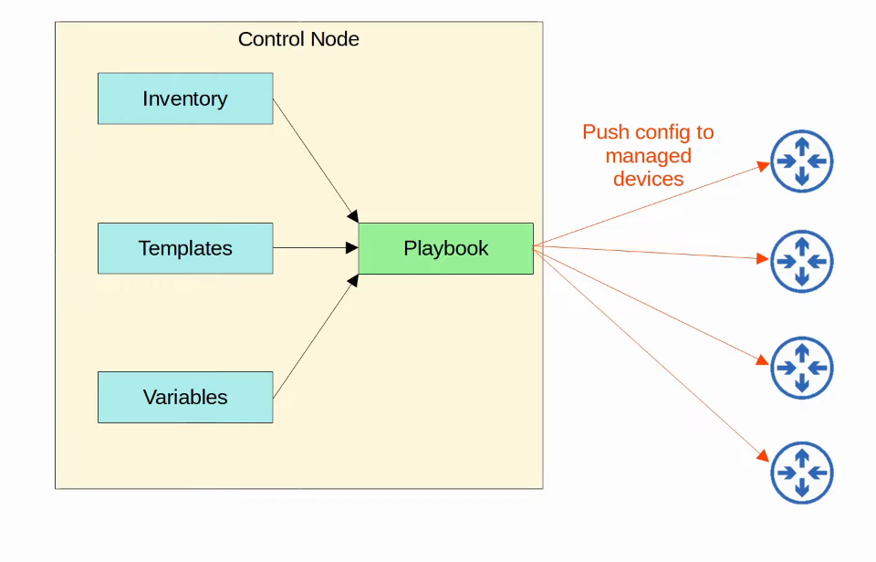

# Day 63 - Ansible

## Configuration Drift

- Configuration drift is when **individual changes made over time cause a device's configuration to deviate from the standard/correct configurations** as defined by the company.
    - Although each device will have unique parts of its configuration (IP addresses, host name, etc.), most of a device's configuration is usually defined in standard templates designed by the network architects/engineers of the company.
    - As individual engineers make changes to devices (e.g. to troubleshoot and fix network issues, test configurations, etc.), the configuration of a device can drift away from the standard.
        - Records of these individual changes and their reasons aren't kept.
        - This can lead to future issues.
- Even without automation tools, it is best to have standard configuration management practices.
    - When a change is made, save the config as a text file and place it in a shared folder.
    - A standard naming system like `hostname_yyyymmdd` might be used.
    - There are flaws to this system, as an engineer might forget to place the new config in the folder after making changes. Which one should be considered the correct config?
    - Even if configurations are properly saved like this, it doesn't guarantee the configurations actualy match the standard.

## Configuration Provisioning

- Configuration provisioning refers to how configuration changes are applied to devices.
    - This includes configuring new devices too.
- Traditionally, configuration provisioning is done by connecting to devices one-by-one via SSH.
    - This is not practical in large networks.
- Configuration management tools like Ansible, Puppet, and Chef allow us to make changes to devices on a mass scale with a fraction of the time/effort.
- Two **essential components**:
    - **Templates**
    - **Variables**

## Configuration Management Tools

- Configuration management tools are network automationtools that facilitate the centralized control of large numbers of network devices (e.g. Ansible, Puppet and Chef).

- These tools were originally developed after the rise of VMS, to enable server system admins to automate the process of creating, configuring and removing VMs.
    - However, they are also widely used to manage network devices.
- These tools can be used to perform tasks such as:
    - Generate configurations for new devices on a large scale.
    - Perform configuration changes on devices (all devuces in your network, or a certain subset of devices).
    - Check device configuration for compliance with defined standards.
    - Compare configurations between devices, and between different versions of configurations on the same file.

## Ansible

- Ansible is a configuration management tool owned by Red Hat.
- Ansible itself is **written in Python**.
- Ansible is **agentless**.
    - It **doesn't require any special software to run on the managed devices**.
- Ansible uses SSH to connect to devices, make configuration changes, extract information. etc.
- Ansible uses a **Push Model**. The **Ansible server (Control node) uses SSH to connect to managed devices and push configuration changes to them**.
    - **Puppet and Chef** use a **pull model**.

- After installing Ansible itself, you must create several text files:
    - **Playbooks:** These files are **'blueprints of automation tasks'**. They **outline the logic and actions of the tasks that Ansible should do**. Written in **YAML**.
    - **Inventory:** These files **list the devices that will be managed by Ansible**, as well as **characteristics of each device** such as their device role (access switch, core switch, WAN router, firewall, etc.). Written in **INI**, **YAML**, or **other formats**.
    - **Templates:** These files **represent a device's configuration file**, but specific variables are not provided. Written in **Jinja2** format.
    - **Variables:** These files list variables and their values. These values are substituted into the templates to create complete configuration files. Written in **YAML**.

    