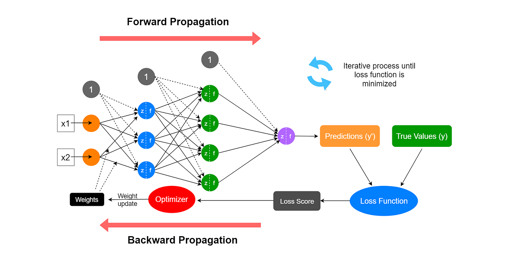

# AI For Network Operations

- **Artificial Intelligence (AI):** A broad term encompassing many underlying technologies that allow a system to simulate human intelligence.

- **Machine Learning (ML):** A subset of AI that can train a model with training  data, and once trained, analyze and make predictions about new data.

- **Supervised Learning:** A type of ML that can be trained on labeled data and then classify new data.
    - we can train our model with training email with labels, so that it can learn how to do something (e.g. identify emails).

- **Unsupervised Learning:** A type of ML that can be trained on unlabeled (i.e., raw) data to see if the data naturally fall into groups and then assign new data to groups.
    - no labels, model forms groups of data with similar characteristics.
    - **in networking:** we can the system learn how to detect malicious traffic without a signature (we can even possibly prevent 0-days)

- **Deep Learning:** A subset of ML that uses artificial neural networks (modeled after the human brain) that can use both supervised and unsupervisde learning (aka semi-supervised learning).

- **Predictive AI:** Can forecast an outcome based on historical data.
    - **in network:** we might be able to forecast network issues (e.g. we might provide network performance collected data and AI might prevent some problems and fixes for them)
    - we're predicting something on the future based on previous events.

- **Generative AI:** Can generate multiple types of output, such as text, video, images or audio.
    - create a network design that meets the following criteria
    - **in networking:** create a network topology from the requirements

### Neural Networks

- **Input Layer:** receives the initial data or features that need to be processed. Each neuron in the input layer corresponds to features of the data. Depending on the specific application, the input layer may preprocess the input data to make it suitable for neural net training. 

- **Hidden Layer:** intermediate layers between the input and output layers. They perform computations on the input data through weighted connections between neurons and transformed using an activation function. The hidden layers, in essence, are responsible for extracting features and patterns from the data.

- **Output Layer:** provides the final result of the neural network’s computation. The number of neurons in the output layer depends on the task at hand. For example, in the case of multi-class classification, the output layer might contain as many nodes as classes.

#### Neurons

#### Training a NN

- We have some train data and we know what the result should be
- We input some values (x1,x2,....,xn) and we use forward propagation. At the end we check if the prediction matches the desired value (using a loss function).
    - If they don't match, we use backward propagation and update weights and bias values until we get closer to the actual value.

## Cisco AI Examples

## Main Benefits

- **Network Design:** GenAI can help us doing network designs.
- **Network Troubleshooting:** If we have a trained model to identify network problems it might detect them early and give us paths of action for fixing it.
- **Detecting Malicious Traffic:** AI can help us detecting malicious traffic based on historical data and previous trends.
- **Predicting Network Issues before they occur**