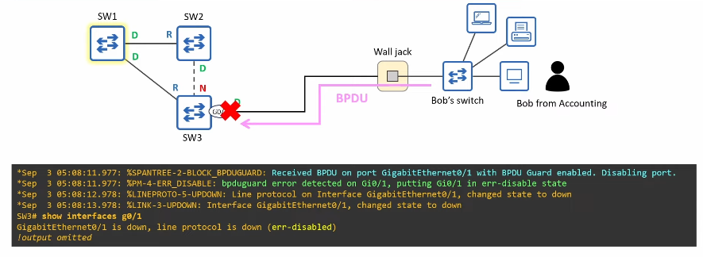
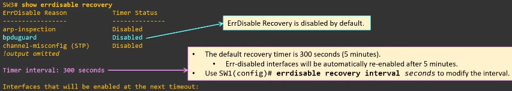
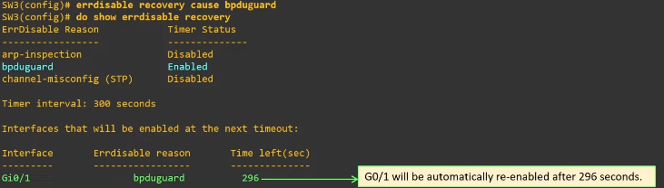
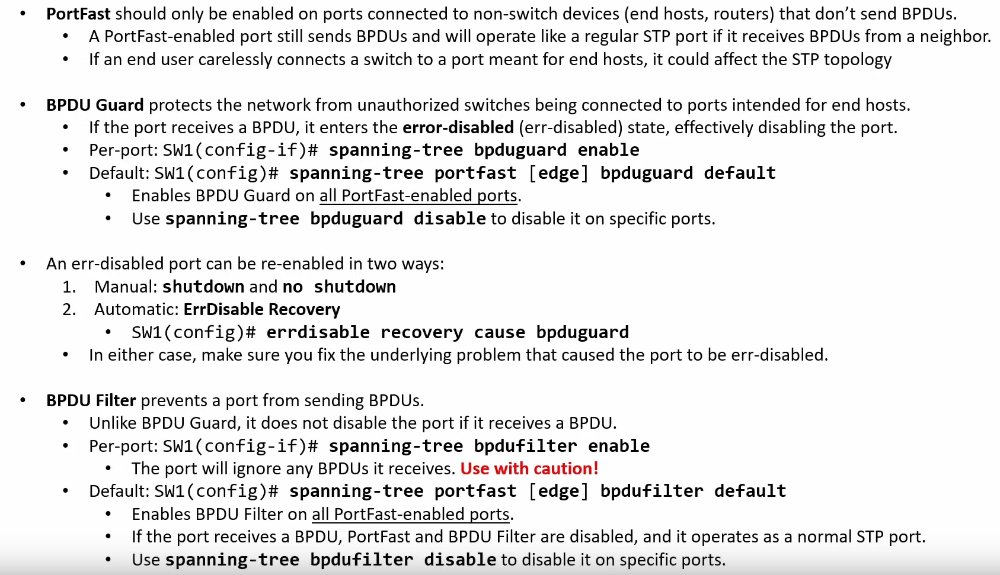

# BPDU Guard & BPDU Filter

## STP Toolkit

- **Porfast:** Allows switch ports connected to end hosts to immediately enter the STP Forwarding state, bypassing Listening and Learning
- **BPDU Guard:** Automatically disables a port if it receives a BPDU, protecting the STP topology by preventing unauthorized devices from becoming part of the network.
- **BPDU Filter:** Stops a port from sending BPDUs or processing received BPDUs.
- **Root Guard:** Prevents a port from becoming a Root Port by disabling it if superior BPDUs are received, thereby enforcing the current Root Bridge.
- **Loop Guard:** Protects the network from loops by disabling a port if it unexpectedly stops receiving BPDUs, ensuring it does not mistakenly enter the Forwarding state.

## BPDU Guard 

### The Problem

- **PortFast** should only be **enabled on ports connected to non-switch devices** (end hosts, routers).
    - **These** devices **don't send BPDUs**.
- A PortFast-enabled port still sends BPDUs and will operate like a regular STP port if it receives BPDUs from a neighbor.
- If an end user carelessly connects a switch to a port meant for end hosts, it could affect the STP topology.
    - BPDU Guard acts as a safeguard against this.

### The Solution

- BPDU Guard **protects the network from unauthorized switches being connected to ports intended for end hosts**.
- It can be configured separately from PortFast, but both features are usually used together.
    - They both enhance STP's functionality on ports intended for end hosts.
- A **BPDU Guard-enabled** **port** **continues to send BPDUs**, but **if it receives a BPDU** it **enters the error-disabled state**.
    - In effect, this disabled the port.

## BPDU Guard configuration

- Like PortFast, BPDU Guard can be configured in two ways:
    - **Per-port:**
        - `SW(config-if)# spanning-tree bpduguard enable`
    - **Default:**
        - `SW(config)# spanning-tree portfast [edge] bpduguard default`
        - When enabled by default, BPDU Guard is **activated on all PortFast enabled ports**.
        
- Using `spnning-tree bpduguard disable` in interface config mode disables bpduguard on specific ports.
- Remember that you can run `show spanning-tree interface <interface-id> detail` to show spanning tree details (such as portfast and bpdu states).

## ErrDisable

- ErrDisable is a Cisco switch feature that disables a port under certain conditions, such as a BPDU Guard violation.
    - There are other conditions, such as Power Policing violations, Port Security violations, DAI (Dynamic ARP Inspection) Violations, etc.

- If a **port is ErrDisabled** it becomes **solid amber**.

- To re-enable an err-disablde port, first solve the underlying issue.
    - If you re-enable the port without fixing the issue, it will just be err-disabled again.

- You can **re-enable an err-disabled port** in two ways:
    - **Manual:** use `shutdown` and `no shutdown` to reset the disabled port.
    - **Automatic:** ErrDisable Recovery

### ErrDisable Recovery

- ErrDisable Recovery is a feature that automatically re-enables err-disabled ports after a certain period of time.

    

- Use `errdisable recovery cause` to enable ErrDisable Recovery forports disablde by a particular cause.

    

- Remember that even with ErrDisable Recovery, if the switch with BPDUGuard receives another BPDU, the port will be errdisabled again.

## BPDU Filter

- A switch port connected to an end host continues sending BPDUs every 2 seconds regardless of whether PortFast and/or BPDU Guard are enabled.
- **If the port** **doesn't connect to a switch**, **sending BPDUs** is **unnecessary and undesirable** for a couple of reasons:
    1. Sending BPDUs **uses some bandwidth and processing power** on the switch (although it's minimal).
    2. BPDUs **contain information about the LANs STP Topology**.
        - If maximum security is a concern, you should avoid sending this info to user devices.
    - **BPDU Filter** **solves this** by **preventing a port from sending BPDUs**.

### The solution

- BPDU Filter stops a port from sending BPDUs.
    - Unlike BPDU Guard, it does not disable the port if it receives a BPDU.

- BPDU Filter can be enabled in two ways:
    - **Per-port:**
        - **`SW(config-if)# spanning-tree bpdufilter enable`**
        - The **port will not send BPDUs**.
        - The **port will ignore any BPDUs it receives**.
        - In effect, this **disables STP on the port**. (use with caution!)
    - **Default:**
        - **`SW(config)# spanning-tree portfast [edge] bpdufilter default`**
        - BPDU Filter will be **activated on all PortFast-enabled ports**.
            - You can use **`spanning-tree bpdufilter disable`** to **disable it on specific ports**.
            - The **port will not send BPDUs**.
            - **If a port receives a BPDU, PortFast and BPDU Filter are disabled**, and it **operates as a normal STP Port**.

### Overview & Tips

- **Enable PortFast and BPDU Guard however you prefer** (per-port or by default).
- **Only enable BPDU Filter by default** (global config mode) unless you have a very good reason to enable it per-port.

**BPDU Guard** and **BPDU Filter** can be **enabled on the same port at the same time**:
    - If **BPDU Filter** is enabled in **global config mode** and the port receives a BPDU:
        1. **BPDU Filter** will be **disabled**.
        2. **BPDU Guard** will be **triggered** (and **err-disable the interface**) 
    - If **BPDU Filter** is **enabled in interface config mode** and the port receives a BPDU:
        - The **BPDU will be ignored**.
        - **BPDU Guard** **will NOT be triggered**.

## Summary

