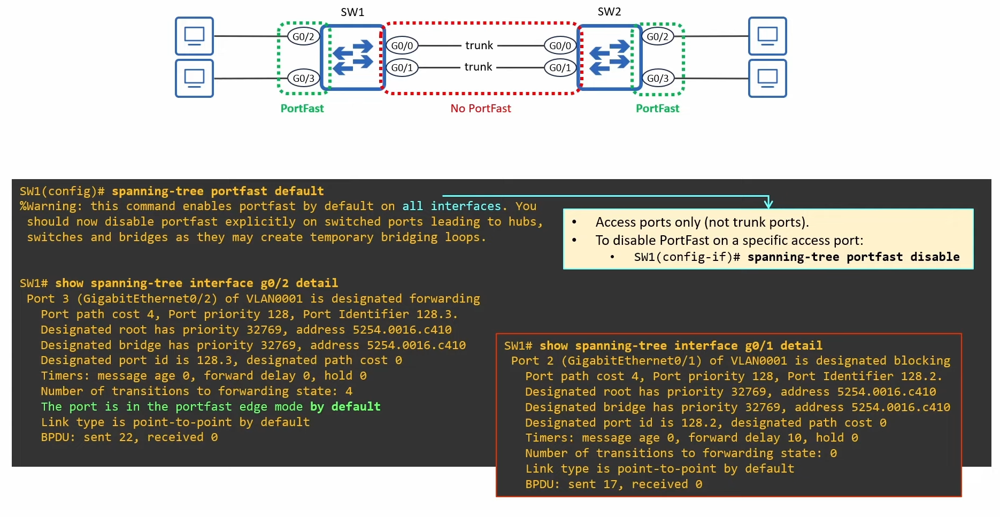
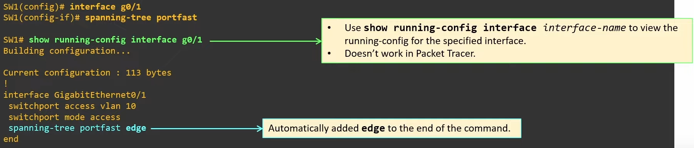

# Portfast

- When an end host connects to a switch port, the port becomes `up/up` but can't send/receive data yet.
    - It is a **Designated port** but will take 30 seconds before it enters the Forwarding state:
        - **15 seconds** in **Listening** 
        - **15 seconds** in **Learning**

- This leads to a poor user experience.

### Lights on Switch

After the able is connected to the console port link light turns on.

- Link lights indicate status.
    - Blinking green lights: Ports are up and ready to send and receive data
    - Blinking amber: Port is up and receiving data, but blocking by STP

---

- **When PortFast is configured** on a port, the **port immediately enters the Forwarding state** when connected to another device.
    - It **bypasses the Listening/Learning** and can send/receive data right away.

## Portfast Configuration

- You can configure Portfast in two ways:

1. Interface config mode:
    - `SW1(config-if)# spanning-tree portfast`
    - This enables PortFast only on the individual interface.

2. Global config mode:
    - `SW1(config)# spanning-tree portfast default`
    - This enables PortFast only on all access ports.
        - Connections between switches are almost always trunk links.
        - Connections between hosts are almost always access links.

- Portfast should be configured on ports connected to switches or temporary Layer 2 loops can occur.
- Even if you configure `spanning-tree portfast` on a trunk port, it won't be active.
- `show spanning-tree interface <interface-name> detail` to show spanning tree details of an interface

- There are **two kinds of Portfast**:
    - **edge**
    - **network** (usde for a feature called Bridge Assurance, not relevant for CCNA)

- To **disable Portfast on a specific access port**: **`spanning-tree portfast disable`**

    - **Note:** Porfast will only be activated on access ports.

### Portfast on trunk ports

- In some cases, you might want to enable PortFast on a trunk port:
    - A port connected to a virtualization server with virtual machines (VMs) in different VLANs.
    - A port connected to a router via router-on-a-stick (ROAS).

- This can only be configured per-port in interface config mode:
    - **`SW1(config-if)# spanning-tree portfast trunk`**

### Portfast Edge

- In modern Cisco switches, if you use the commands covered in this lecture, the device will automatically add the `edge` keyword to the configuration.

- You can use either version of the commands when configuring PortFast.
- The end result is the same: `edge` will be added in the configuration.
- `spanning-tree portfast disable` doesn't use the `edge` keywords.

