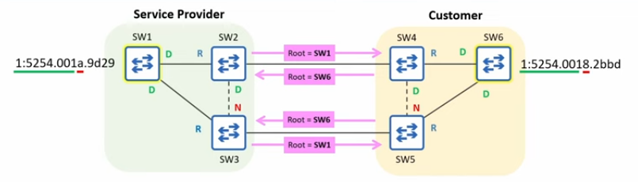
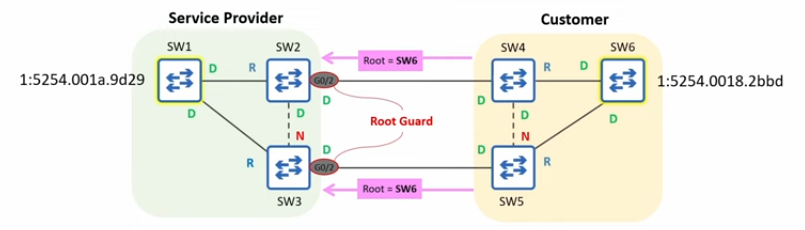

# Root Guard

## Root Bridge Placement

- STP prevents loops by electing a root bridge and ensuring that each other switch has only one valid path to reach it.
- You shouldn't randomly select the root bridge. Some things you should consider include:
    - **Optimal traffic flow**
        - minimize latency
        - minimize congestion
    - **Stability and reliability**

## Root Guard: The Problem

- Within your own LAN, you can easily control the root bridge by setting its priority to 0.
    - But there are cases where you might connect your LAN to other switches outside of your direct control.
        - A service provider offering Metro Ethernet service to customers.
            - often used to connect sites within a MAN (Metropolitan Area Network)

- Even if you set your root bridge's priority to 0, its role can be taken by another switch with a lower MAC address.

- With no safeguard in place, SWI1, SW2 and SW3 accept SW6 as the root bridge, affectin the service provider's STP topology.
    - Frames from SW3 to SW1 must take a detour through the customer's LAN.

## Root Guard: The Solution

- **Root Guard** can be configured to protect your STP topology by preventing your switches from accepting superior BPDUs from switches outside of your control.
    - **Superior BPDU** => a BPDU that is superior in the STP priority (e.g. claiming a better root bridge ID).

- If you want to ensure that the root bridge remains in your LAN, you can configure Root Guard on the ports connected to switches outside of your control.
    - SW2 G0/2, SW3 G0/2

- Use `SW2(config-if)# spanning-tree guard root` to enable Root Guard on a port.
    - There is no command to enable it by default from global config mode.

- If a root Guard-enabled port receives a BPDU, it will enter the **Broken (Root Inconsistent)** state, effectively disabling it.
    - The port will not be able to forward data frames and will discard any frames it receives.
    - SW1, SW2 and SW3 won't accept SW6 as the root bridge.

- To re-enable a port disabled by Root Guard, you must solve the issue that disabled the port.
    - The disabled port must stop receiving superior BPDUs.
    - Tell the customer to increase the priority value of their switch.

- Once the superior BPDUs received by SW2 G0/2 and SW3 G0/3 age out, the ports will automatically be re-enabled.
    - A BPDU's Max Age is 20 seconds by default.

- Root Guard prevents a port from becoming a root port if it receives a superior BPDU.
    - If te port receives a superior BPDU, it becomes Broken (BKN) / Root Inconsistent (ROOT_Inc)

- If the port stops receiving superior BPDUs, it will automatically recover.